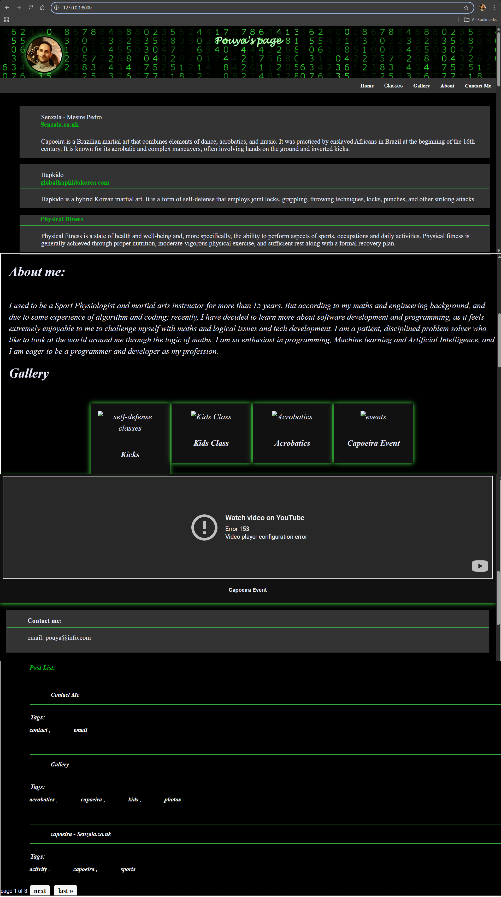
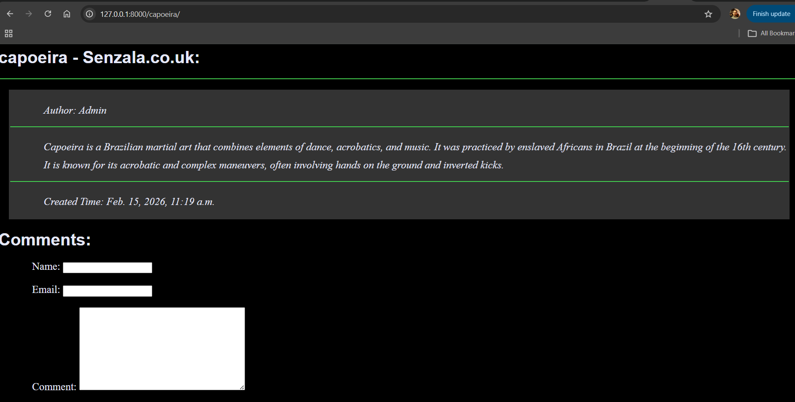
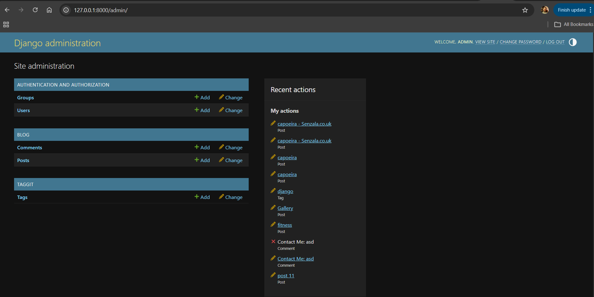

  

<h1 align="center">My Webpage – Django Personal Website</h1>

A personal website and blog system built with Django.

---

# Table of Contents

- Overview
- Website Preview
- Features
- Technologies Used
- Project Architecture
- Project Structure
- Installation
- Admin Panel
- Learning Outcomes
- Future Improvements
- Author

---

# Overview

This project is a **personal website built with Django** that combines a modern single-page layout with a dynamic blog system.

The homepage contains multiple sections accessible through a navigation bar:

- Home
- Classes
- About
- Gallery
- Contact Me
- Blog Post List

Users can scroll through the page or jump directly to sections using the navigation menu.

Blog posts allow visitors to explore topics related to classes and activities and leave moderated comments.

---

# Website Preview

## Home Page

---

## Blog Post Page

---

## Django Admin Panel

---

# Features

## Navigation Menu

The website includes a navigation bar that scrolls to different sections of the homepage.

Sections include:

- Home
- Classes
  - Capoeira
  - Fitness
  - Self-defense
- About
- Gallery
- Contact Me

---

## Blog Post System

The homepage includes a **Post List** displaying blog articles.

Each post includes:

- Title
- Author
- Content
- Creation date
- Tags

Clicking a post opens a **dedicated post detail page**.

---

## Comment System

Each post contains a comment form where visitors can submit:

- Name
- Email
- Comment

Comments are **moderated by the administrator** before appearing publicly.

---

## Tagging System

Posts use **django-taggit** for tag management.

Example tags include:

- capoeira
- sports
- activity
- photos
- contact

---

## Gallery Section

The gallery displays images related to:

- Self-defense classes
- Kids classes
- Acrobatic training
- Capoeira events

---

# Technologies Used

## Backend

- Python
- Django

## Frontend

- HTML
- CSS

## Database

- SQLite

## Django Libraries

- django-taggit

---

# Project Architecture

The project follows Django's **Model-View-Template architecture**.

**Models**

Define database structure for posts and comments.

**Views**

Handle requests and pass data to templates.

**Templates**

Render dynamic HTML pages.

**Admin**

Allows management of posts, comments, and tags.

**Static Files**

CSS styling and frontend layout.

---

# Project Structure

My-Webpage
│
├── blog
│     ├── migrations
│     ├── static
│  │  └── css
│  │  └── style.css
│  │
│  ├── templates
│  │  ├── base.html
│  │  ├── contact_me.html
│  │  ├── post_detail.html
│  │  └── post_list.html
│  │ 
│  ├── templatetags
│  │  └── my_tags.py
│  │
│  ├── admin.py
│  ├── forms.py
│  ├── models.py
│  ├── urls.py
│  └── views.py
│
├── Images-and-videos
│
├── mysite
│  ├── settings.py
│  ├── urls.py
│  ├── asgi.py
│  └── wsgi.py
│
├── db.sqlite3
├── manage.py
└── README.md

---

# Installation

Clone the repository

git clone https://github.com/Pouya-Nasraei/My-Webpage.git

cd My-Webpage

Create virtual environment

python -m venv venv

Activate it

Windows

venv\Scripts\activate

Mac/Linux

source venv/bin/activate

Install dependencies

pip install django
pip install django-taggit

Apply migrations

python manage.py migrate

Create admin user

python manage.py createsuperuser

Run the development server

python manage.py runserver

Open:
http://127.0.0.1:8000

Admin panel:

http://127.0.0.1:8000/admin

---

# Admin Panel

The Django Admin interface allows management of the website content.

Administrators can:

- Create and edit blog posts
- Approve or delete comments
- Manage tags
- Manage users
- View recent actions

---

# Learning Outcomes

This project helped practice:

- Django project architecture
- Database modeling with Django ORM
- Template inheritance
- Blog system implementation
- Comment moderation
- Tagging with django-taggit
- Custom template tags
- Static file management
- Pagination
- Django Admin configuration

---

# Future Improvements

Possible enhancements include:

- User authentication
- Rich text editor for posts
- Image uploads
- AJAX comment submission
- Search functionality
- REST API using Django REST Framework
- Deployment to cloud platforms

---

# Author

Pouya  
Software Development Student

Interests:

- Software Engineering
- Artificial Intelligence
- Machine Learning
- Web Development
